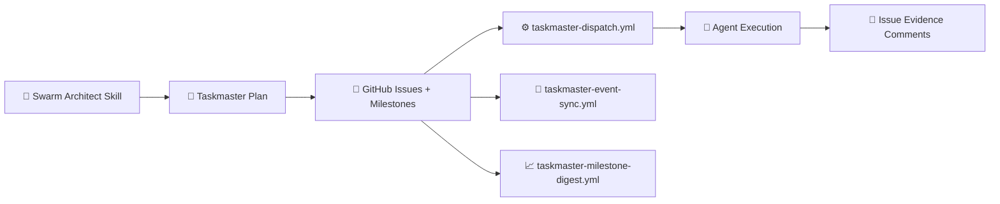

<div align="center">


<!-- readme-gen:start:badges -->


<!-- readme-gen:end:badges -->

<!-- readme-gen:start:tech-stack -->
<p align="center">
  
</p>
<!-- readme-gen:end:tech-stack -->

</div>

> Move from **issue creation** to **full orchestration**: phase/wave/swarm planning, milestone-aware execution, agent routing, and event-driven GitHub automation.


## What this repository contains

- `skills/swarm-architect/SKILL.md` — orchestration-first planning skill
- `skills/task-master-planner/SKILL.md` — detailed taskmaster protocol with agent/action contracts
- `.github/workflows/taskmaster-dispatch.yml` — task-level dispatch entrypoint
- `.github/workflows/taskmaster-event-sync.yml` — event-driven issue/PR sync
- `.github/workflows/taskmaster-milestone-digest.yml` — progress digest and milestone telemetry

## Why this is different

<table>
<tr>
<td width="50%" valign="top">

### 🤖 Agent-aware by design
Each task explicitly maps to `agent_class`, execution mode, and workflow hooks.

</td>
<td width="50%" valign="top">

### ⚙️ Actions-native orchestration
Built for `workflow_dispatch` + issue/pr event loops + milestone digest updates.

</td>
</tr>
<tr>
<td width="50%" valign="top">

### 🧭 Dependency-safe swarm execution
Phases → Waves → Swarms with strict dependency discipline and verification gates.

</td>
<td width="50%" valign="top">

### 📊 Evidence-driven completion
Completion requires run URLs, acceptance evidence, and validation artifacts.

</td>
</tr>
</table>

## Quick start

```bash
git clone https://github.com/Sheshiyer/swarm-architect-orchestrator-skill.git
cd swarm-architect-orchestrator-skill
```

1. Copy `skills/swarm-architect/SKILL.md` and/or `skills/task-master-planner/SKILL.md` into your agent workspace.
2. Use the workflow files in `.github/workflows/` to wire dispatch + event sync + milestone digest.
3. Ensure issue titles carry stable task tokens (e.g., `[T042]`) and issue bodies include orchestration metadata.


## Architecture

<!-- readme-gen:start:architecture -->

<!-- readme-gen:end:architecture -->

## Project health

<!-- readme-gen:start:health -->
| Category | Status | Score |
|:--|:--:|--:|
| Workflow scaffolding | ████████████████████ | 100% |
| Skill completeness | ████████████████████ | 100% |
| Orchestration metadata | ████████████████████ | 100% |
| Documentation | ██████████████████░░ | 90% |
| Demo portability | ███████████████░░░░░ | 75% |

> **Overall: 93% — orchestration-ready**
<!-- readme-gen:end:health -->


## NPX Install Layer (skills.sh wrapper)

You can install this skill pack through a branded NPX entrypoint:

```bash
npx @sheshiyer/swarm-architect-skill
```

Under the hood it runs:

```bash
npx skills add Sheshiyer/swarm-architect-orchestrator-skill
```

More options: [`docs/NPX_INSTALL.md`](docs/NPX_INSTALL.md)

## OpenClaw Integration (Idea → Swarm Flow)

You can now trigger swarm planning from OpenClaw without CLI-first behavior.

### Trigger phrase
- **"Use swarm architect for this idea"**

### Wrapper assets
- [`docs/OPENCLAW_INTEGRATION.md`](docs/OPENCLAW_INTEGRATION.md)
- [`integrations/openclaw/swarm-intake.schema.json`](integrations/openclaw/swarm-intake.schema.json)
- [`integrations/openclaw/swarm-wrapper-playbook.md`](integrations/openclaw/swarm-wrapper-playbook.md)
- [`.github/workflows/openclaw-swarm-intake.yml`](.github/workflows/openclaw-swarm-intake.yml)

### What happens
1. OpenClaw captures idea + constraints
2. Wrapper normalizes payload
3. Initial Taskmaster tasks are auto-dispatched
4. Event sync + milestone digest continue orchestration


## License

MIT (recommended). Add a LICENSE file if your org requires explicit licensing.

<!-- readme-gen:start:footer -->
<div align="center">


Built with ❤️ for autonomous delivery systems.

</div>
<!-- readme-gen:end:footer -->
